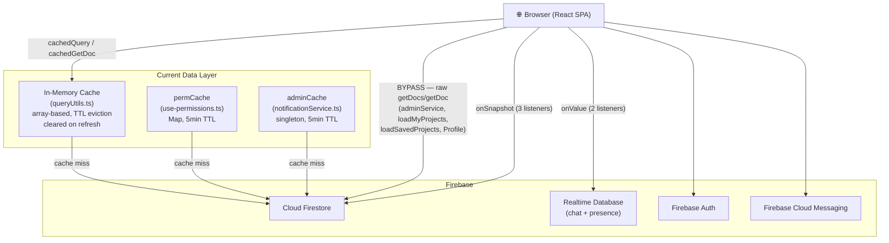
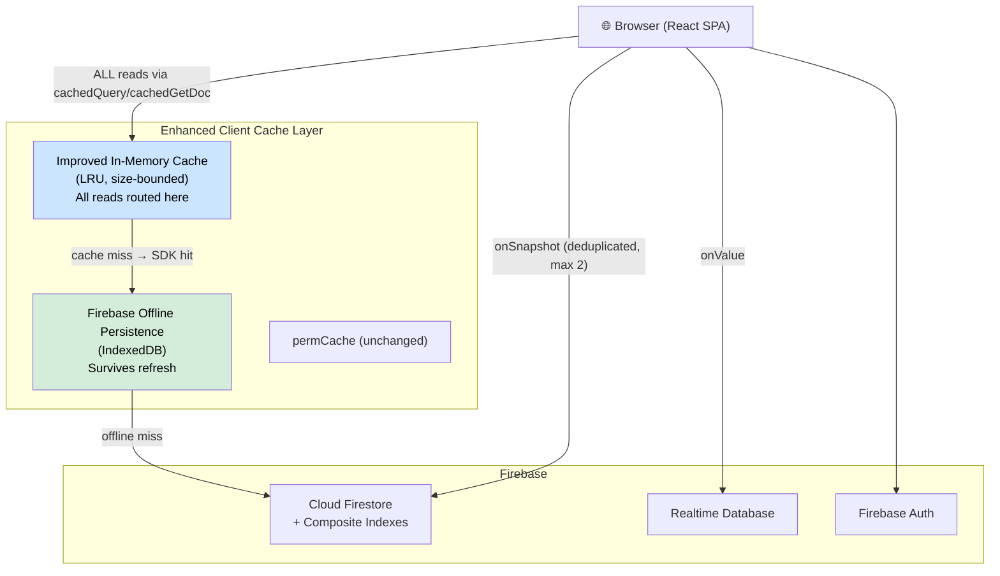

# Procollab — Data Access & Caching Architecture Report

> **Role**: Senior Backend Architect Analysis  
> **Codebase**: `sohail262/Procollab-react` (Vite + React 18 + Firebase v12 + Firestore)  
> **Date**: June 2026

---

## Table of Contents

1. [Executive Summary](#1-executive-summary)
2. [Firestore Usage](#2-firestore-usage)
3. [Existing Caching](#3-existing-caching)
4. [Read Path Analysis](#4-read-path-analysis)
5. [Performance Analysis](#5-performance-analysis)
6. [Redis Readiness Assessment](#6-redis-readiness-assessment)
7. [Architecture Diagrams](#7-architecture-diagrams)
8. [Recommended Implementation Roadmap](#8-recommended-implementation-roadmap)
9. [Implementation Plan — Cache Layer](#9-implementation-plan--cache-layer)

---

## 1. Executive Summary

Procollab is a **client-side-only** SPA backed by **Cloud Firestore** (primary store) and **Firebase Realtime Database** (chat + presence). There is **no backend server** — all data access happens directly from the browser via the Firebase JS SDK.

A custom **in-memory query cache** exists in [`queryUtils.ts`](file:///c:/Users/itssp/Desktop/Procollab-git/Procollab-react/src/lib/queryUtils.ts) with TTL-based eviction, request deduplication, and a rate limiter. However several **critical paths bypass this cache entirely** (notably `loadMyProjects`, `loadMyApplications`, `loadSavedProjects`, `loadNotifications`, and all of `adminService.ts`).

The most severe issues are:
- **3× full collection scans** (`getDocs(collection(db, 'users'))`) in `adminService.ts`
- **Classic N+1 pattern** in `loadSavedProjects` and `loadMyApplications` (fixed in some places, broken in others)
- **Duplicate real-time listeners + one-shot reads** for the same data on the Dashboard
- **Only 1 composite index** declared in `firestore.indexes.json` — missing ~8 required indexes
- **No Firebase offline persistence** enabled
- **No React Query / SWR** — state is entirely local component state

### Verdict

Redis is **not yet justified**. The immediate priority is:
1. Fix uncached N+1 reads
2. Enable Firebase offline persistence
3. Add missing Firestore composite indexes
4. Centralise all reads through `cachedQuery` / `cachedGetDoc`
5. Replace duplicate listeners with a shared context

---

## 2. Firestore Usage

### 2.1 Collections Accessed

| Collection | Sub-collections | Purpose |
|---|---|---|
| `users` | `applications`, `notifications`, `savedProjects`, `connectionRequests`, `friends` | User profiles, activity |
| `projects` | `tasks`, `activities`, `members` | Project data |
| `announcements` | — | Admin announcements |
| `reports` | — | Content reports |
| `moderationQueue` | — | Moderation pipeline |
| `adminLogs` | — | Admin audit trail |
| `dailyStats` | — | Platform growth aggregates |

> **Firebase Realtime Database** (not Firestore) is additionally used for `chats/{projectId}` and `projectMembers/{projectId}/{uid}`.

---

### 2.2 Read Operations (Categorised)

#### One-shot reads (`getDoc` / `getDocs`)

| Location | Query | Uses Cache? | Notes |
|---|---|---|---|
| `AuthContext` — `login()` | `getDoc users/{uid}` | ❌ No | Every login fires a raw `getDoc` |
| `AuthContext` — `onAuthStateChanged` | `getDoc users/{uid}` | ❌ No | Fires on every app load |
| `AuthContext` — `loginWithGoogle/Github` | `getDoc users/{uid}` | ❌ No | Redundant with above |
| `dashboardService.loadDashboardStats` | 4× `cachedQuery` on sub-collections (limit 1) | ✅ Yes | Good — TTL 10 min |
| `dashboardService.loadRecentActivity` | 2× `cachedQuery` (notifications + applications) | ✅ Yes | TTL 2–5 min |
| `dashboardService.loadRecommendedProjects` | `cachedGetDoc users/{uid}` + `cachedQuery applications` + `cachedQuery projects limit(40)` | ✅ Yes | Best-cached path |
| `dashboardService.loadMyProjects` | `getDocs projects where createdBy == userId orderBy createdAt` | ❌ **No cache** | **High-frequency miss** |
| `dashboardService.loadMyApplications` | `getDocs users/{uid}/applications` + loop `getDoc projects/{id}` | ❌ **No cache + N+1** | **Critical issue** |
| `dashboardService.loadNotifications` | `getDocs users/{uid}/notifications orderBy limit(50)` | ❌ **No cache** | Fetches 50 docs every visit |
| `dashboardService.loadSavedProjects` | `getDocs users/{uid}/savedProjects` + loop `getDoc projects/{id}` | ❌ **No cache + N+1** | **Critical issue** |
| `Profile.tsx` — `loadProfile` | `getDoc users/{profileId}` + `getDocs projects where createdBy` + `getDocs users/{uid}/applications` | ❌ No | Raw, no cache |
| `Profile.tsx` — `onSnapshot friends` | loop `getDoc users/{uid}` for each friend | ❌ **No cache + N+1** | Every friend change re-fetches all |
| `connectionService.getConnectionStatus` | 3× `getDoc` (friends, outgoing, incoming) | ❌ No | Called per user card in Discover |
| `use-permissions.ts` — `fetchPermissions` | `getDoc projects/{id}` + `getDoc projects/{id}/members/{uid}` | ✅ Partial | Module-level `permCache` (5 min TTL) |
| `adminService.loadPlatformStats` | `getDocs users` + `getDocs projects` | ❌ **No cache — FULL SCAN** | 💀 Most expensive read |
| `adminService.loadAllUsers` | `getDocs users orderBy createdAt limit(1000)` | ❌ No cache | 1000 docs in memory |
| `adminService.loadAllProjects` | `getDocs projects orderBy createdAt limit(1000)` | ❌ No cache | 1000 docs in memory |
| `adminService.notifyAllUsers` | `getDocs users` (full scan) | ❌ **No cache — FULL SCAN** | Reads every user to write notifications |
| `adminService.calculateGrowthDataFromRaw` | `getDocs users` + `getDocs projects` (full scans) | ❌ No cache | Triggered as fallback |
| `notificationService.getAdminUids` | 3× parallel `getDocs users where role == X` | ✅ Module-level 5 min TTL | Well-designed |
| `paginationService.loadPaginatedUsers` | `getDocs users orderBy createdAt limit(11)` | ✅ `cachedQuery` (5 min) | Good |
| `paginationService.loadPaginatedProjects` | `getDocs projects orderBy createdAt ...` | ✅ `cachedQuery` (3 min) | Good |

#### Real-time listeners (`onSnapshot`)

| Location | Query | Notes |
|---|---|---|
| `Dashboard.tsx` — `subscribeToNotifications` | `users/{uid}/notifications where read==false orderBy limit(10)` | Stays open while dashboard mounted |
| `Dashboard.tsx` — `subscribeToRecentActivity` | `users/{uid}/notifications orderBy limit(10)` | **Duplicate stream** — same collection as above |
| `ProjectDashboard.tsx` — Effect 2 | `projects/{id}/tasks` (full sub-collection) | Permission-gated — correct |
| `ProjectDashboard.tsx` — Effect 3 | `projects/{id}/activities orderBy desc limit(10)` | Stays open while mounted |
| `ProjectDashboard.tsx` — Effect 1.5 | RTDB `chats/{id}` + `projectMembers/{id}/{uid}` | Realtime DB — not Firestore |
| `Profile.tsx` — `unsubFriends` | `users/{profileId}/friends` (collection) | Fires for each profile view |
| `Profile.tsx` — connection listeners | 2× `onSnapshot` on single docs | Minor overhead |

---

### 2.3 Write Operations

| Location | Operation | Target | Notes |
|---|---|---|---|
| `AuthContext` — `register` | `setDoc` | `users/{uid}` | Full user doc |
| `AuthContext` — `login` | `setDoc (merge)` | `users/{uid}` | Updates timestamps on every login |
| `AuthContext` — `extendSession` | `setDoc (merge)` | `users/{uid}` | Timer fires every 5 min if active |
| `connectionService.sendConnectionRequest` | `batch.set` | `users/{target}/connectionRequests/{sender}` | + notification |
| `connectionService.acceptConnectionRequest` | batch (set×2 + delete) | `users/*/friends/*` | + notification |
| `connectionService.rejectConnectionRequest` | batch delete + notification | `connectionRequests` | — |
| `adminService.approveProject` | batch (update + update modQ) | `projects` + `moderationQueue` | — |
| `adminService.rejectProject` | batch (update + update modQ + notify) | Multi-doc | — |
| `adminService.notifyAllUsers` | `writeBatch` (chunked at 499) | `users/*/notifications` | Expensive at scale |
| `notificationService.sendNotification` | `writeBatch` 1 doc | `users/{uid}/notifications` | — |
| `ProjectDashboard.tsx` — `handleSaveTask` | `addDoc` / `updateDoc` | `projects/{id}/tasks/{id}` | — |

---

### 2.4 Expensive Queries

| Query | Why Expensive | Priority |
|---|---|---|
| `getDocs(collection(db, 'users'))` — 3× in `adminService` | Full table scan — reads **all** user documents regardless of count | 🔴 High |
| `loadMyApplications` — N+1 `getDoc projects` in loop | 1 + N reads for N applications | 🔴 High |
| `loadSavedProjects` — N+1 `getDoc projects` in loop | 1 + N reads for N saved projects | 🔴 High |
| `Profile.tsx` friends listener — N+1 `getDoc users` per friend | Every snapshot fires N reads | 🟠 Medium |
| `loadNotifications` — no cache, limit 50 | 50 docs fetched every Dashboard mount | 🟠 Medium |
| `Discover.tsx` — `checkConnectionStatuses` per page | 1 `getDocs friends` + 1 `getDocs incoming` + N `cachedGetDoc` per scroll | 🟡 Low (partially cached) |

---

### 2.5 N+1 Query Patterns

#### Pattern 1: `loadMyApplications` (Critical)
```
getDocs(users/{uid}/applications)          → 1 read
  for each application:
    getDoc(projects/{appData.projectId})   → N reads
```
**Fix**: Collect all projectIds, use `batchGetDocs` (already exists in `queryUtils.ts`).

#### Pattern 2: `loadSavedProjects` (Critical)
```
getDocs(users/{uid}/savedProjects)         → 1 read
  for each savedDoc:
    getDoc(projects/{savedDoc.id})         → N reads
```
**Fix**: Same — batch the project lookups.

#### Pattern 3: `Profile.tsx` friends `onSnapshot` (Medium)
```
onSnapshot(users/{profileId}/friends)      → 1 listener
  for each friend in snap.docs:
    getDoc(users/{friend.id})              → N reads on EVERY snapshot update
```
**Fix**: Store display name in the `friends` sub-document at write time (already stored as `name` field — use it directly instead of re-fetching).

---

### 2.6 Missing Firestore Indexes

Only **1 index** is declared in [`firestore.indexes.json`](file:///c:/Users/itssp/Desktop/Procollab-git/Procollab-react/firestore.indexes.json). The following composite indexes are required for queries to not result in Firestore index errors or full scans:

| Collection | Fields | Query Location |
|---|---|---|
| `users/{uid}/notifications` | `read ASC`, `timestamp DESC` | `subscribeToNotifications`, `loadDashboardStats` |
| `users/{uid}/notifications` | `timestamp DESC` | `subscribeToRecentActivity`, `loadRecentActivity`, `loadNotifications` |
| `users/{uid}/applications` | `appliedAt DESC` | `loadRecentActivity`, `loadMyApplications` |
| `projects` | `createdBy ASC`, `createdAt DESC` | `loadMyProjects`, `Profile.tsx` |
| `projects` | `moderationStatus ASC`, `createdAt DESC` | `getPendingModerationProjects` |
| `projects` | `status ASC`, `primaryDiscipline ASC`, `createdAt DESC` | `loadPaginatedProjects` with filters |
| `reports` | `status ASC`, `createdAt DESC` | `getPendingReports` |
| `moderationQueue` | `status ASC`, `createdAt DESC` | `loadModerationQueue` |
| `dailyStats` | `date ASC` | `loadGrowthData` |

> [!WARNING]
> Without these indexes, Firestore falls back to in-order document scanning. On large collections this dramatically increases latency and read costs.

---

## 3. Existing Caching

### 3.1 Cache Inventory

| Cache Type | Present? | Details |
|---|---|---|
| **React Query** | ❌ No | Not installed |
| **SWR** | ❌ No | Not installed |
| **Next.js Cache** | ❌ No | Not a Next.js app |
| **Browser Cache (HTTP)** | ⚠️ Partial | Static assets only (Vite build) |
| **Service Worker Cache** | ⚠️ Partial | FCM service worker exists (`public/firebase-messaging-sw.js`) — for push notifications only, not data caching |
| **In-Memory Cache** | ✅ **Yes** | Custom in [`queryUtils.ts`](file:///c:/Users/itssp/Desktop/Procollab-git/Procollab-react/src/lib/queryUtils.ts) |
| **Module-Level Cache** | ✅ **Yes** | `permCache` in `use-permissions.ts`, `adminCache` in `notificationService.ts` |
| **Firebase Offline Persistence** | ❌ No | `enableIndexedDbPersistence` not called |
| **Redis** | ❌ No | No backend server exists |
| **IndexedDB** | ❌ No | Not used directly |

---

### 3.2 Custom In-Memory Cache — `queryUtils.ts`

#### How It Works

```
cacheEntries: CacheEntry[]          // module-level flat array
pendingRequestsList: PendingRequest[] // in-flight deduplication
rateLimiter: Map<userId, {count, reset}> // per-user rate limiting
```

**Cache hit flow:**
1. `cachedQuery(q, options)` is called
2. `findCachedEntry(q, customKey)` scans `cacheEntries[]` for a matching query (using `queryEqual` / `refEqual` from Firestore SDK) or a matching `customKey` string
3. If a valid (non-expired) entry is found → return cached `QuerySnapshot` immediately
4. If an identical in-flight request exists → deduplicate and share the same Promise
5. Otherwise execute `getDocs(q)`, store result, return

**Cache eviction:**
- `setInterval(cleanupCache, 10 min)` removes expired entries
- `clearCache(pattern?)` allows targeted invalidation by key or collection path substring

**TTL values currently in use:**

| Data | TTL | File |
|---|---|---|
| Dashboard stats (counts) | 10 min | `dashboardService.ts` |
| Recent activity (notifications) | 2 min | `dashboardService.ts` |
| Recent activity (applications) | 5 min | `dashboardService.ts` |
| Recommended projects | 5 min | `dashboardService.ts` |
| User profile doc | 10 min | `dashboardService.ts` |
| Paginated users (Discover) | 5 min | `paginationService.ts` |
| Paginated projects | 3 min | `paginationService.ts` |
| Connection status check | 5 min (default) | `queryUtils.ts` default |
| Permissions | 5 min | `use-permissions.ts` (separate cache) |
| Admin UIDs | 5 min | `notificationService.ts` (separate cache) |

**Weaknesses:**
- Cache stores the actual `QuerySnapshot` object — if Firestore mutates underlying data, stale snapshots remain
- No LRU or size limit — unbounded memory growth possible
- No persistence — cleared on page refresh
- `cacheEntries` is a linear array: O(N) lookup — fine at current scale, will degrade with thousands of entries
- Many high-frequency paths bypass the cache entirely

---

### 3.3 `permCache` — `use-permissions.ts`

Module-level `Map<string, CacheEntry>` keyed on `{projectId}:{userId}`.
- **TTL**: 5 min for successful resolutions, 30 sec for failed/not-member resolutions
- **Invalidation**: `invalidatePermissionsCache(projectId, userId)` or `invalidateAllPermissionsCache()`
- **Works correctly** — the dual-TTL strategy is a nice touch

---

### 3.4 `adminCache` — `notificationService.ts`

Module-level singleton object holding admin UIDs with a 5-minute TTL.
- Refreshed lazily on next call after expiry
- `invalidateAdminCache()` available for explicit invalidation
- **Works well** — prevents 3 Firestore reads per notification trigger

---

## 4. Read Path Analysis

### 4.1 Dashboard (`/dashboard`)

**Request flow on mount:**
```
Dashboard.tsx
  → loadDashboardStats(uid)          → 4× cachedQuery (counts)        [✅ cached 10 min]
  → loadRecentActivity(uid)          → 2× cachedQuery                 [✅ cached 2–5 min]
  → loadRecommendedProjects(uid)     → cachedGetDoc + 2× cachedQuery  [✅ cached 5–10 min]
  → loadMyProjects(uid)              → getDocs (NO CACHE)             [❌ cache miss]
  → loadMyApplications(uid)          → getDocs + N×getDoc (NO CACHE)  [❌ N+1 cache miss]
  + subscribeToNotifications(uid)    → onSnapshot (persistent)        [real-time]
  + subscribeToRecentActivity(uid)   → onSnapshot (persistent)        [duplicate stream]
```

**Cacheability:**
- Stats: **Highly cacheable** — TTL 10 min ✅
- Activity: **Moderately cacheable** — TTL 2 min ✅
- Recommended projects: **Highly cacheable** — TTL 5 min ✅  
- My projects: **Moderately cacheable** — changes rarely mid-session; **TTL recommended: 5 min**
- Applications: **Moderately cacheable** — **TTL recommended: 3 min**

**Duplicate stream problem**: Both `subscribeToNotifications` and `subscribeToRecentActivity` listen on `users/{uid}/notifications`. This means Firestore opens **2 persistent connections** to the same collection. One listener should be removed or merged.

---

### 4.2 Project Dashboard (`/project/:id`)

**Request flow:**
```
ProjectDashboard.tsx
  → getDoc(projects/{id})                              [❌ no cache — raw getDoc]
  → usePermissions()                                   [✅ permCache]
  → onSnapshot(projects/{id}/tasks)                   [real-time — correct]
  → onSnapshot(projects/{id}/activities limit 10)     [real-time — correct]
  → RTDB: onValue(chats/{id}) + onValue(projectMembers/{id}/{uid})
```

The project doc itself is fetched raw on every navigation — **cacheable for 5 min**.

---

### 4.3 Discover (`/discover`)

```
Discover.tsx
  → loadPaginatedUsers()                              [✅ cachedQuery 5 min]
  → checkConnectionStatuses(people)
      → getDocs(users/{uid}/friends)                  [❌ no cache]
      → getDocs(users/{uid}/connectionRequests)       [❌ no cache]
      → N× cachedGetDoc(users/{pid}/connectionRequests/{uid}) [✅ partially cached]
```

Friends and incoming requests are fetched raw on every Discover load and every infinite-scroll page.  
**TTL recommended: 1 min** (connection state changes frequently).

---

### 4.4 Profile (`/profile/:id`)

```
Profile.tsx
  → getDoc(users/{profileId})                         [❌ no cache]
  → getDocs(projects where createdBy == profileId)    [❌ no cache]
  → getDocs(users/{uid}/applications)                 [❌ no cache, own profile only]
  → onSnapshot(users/{profileId}/friends)             [real-time]
      → N× getDoc(users/{friendId})                   [❌ N+1, no cache]
  → getConnectionStatus()                             [❌ 3× getDoc, no cache]
```

**Most cacheable**: user doc (10 min), projects (5 min), connection status (30 sec).

---

### 4.5 Admin Dashboard (`/admin`)

```
adminService
  → getDocs(collection(db, 'users'))    [❌ FULL SCAN, no cache]   ← loadPlatformStats
  → getDocs(collection(db, 'projects')) [❌ FULL SCAN, no cache]   ← loadPlatformStats
  → getDocs(users) limit 1000           [❌ no cache]              ← loadAllUsers
  → getDocs(projects) limit 1000        [❌ no cache]              ← loadAllProjects
  → getDocs(announcements)              [❌ no cache]
  → getDocs(adminLogs) limit 100        [❌ no cache]
  → getDocs(moderationQueue) pending    [❌ no cache]
  → getDocs(reports) pending            [❌ no cache]
```

**Cacheability**: Admin data changes infrequently. Platform stats: **Highly cacheable — TTL 5 min**. Moderation queue: **Moderately cacheable — TTL 30 sec**. User/project lists: **Moderately cacheable — TTL 2 min**.

---

## 5. Performance Analysis

### 5.1 Most Frequently Accessed Documents

| Document / Collection | Access Frequency | Consumers |
|---|---|---|
| `users/{uid}` | 🔴 Every login + auth state change | AuthContext (3 paths), dashboardService, Profile, connectionService |
| `projects` (collection) | 🔴 Dashboard load, Discover, Profile | dashboardService, paginationService, adminService |
| `users/{uid}/notifications` | 🔴 Dashboard mount + real-time | dashboardService (cached + listener ×2) |
| `projects/{id}` (single) | 🟠 Every project dashboard open | ProjectDashboard, use-permissions |
| `users/{uid}/applications` | 🟠 Dashboard + profile | dashboardService (cached), Profile (not cached) |
| `users/{uid}/friends` | 🟡 Discover + Profile | Discover (uncached), Profile (listener) |

---

### 5.2 Most Expensive Queries (By Read Count)

| Rank | Query | Est. Reads | Location |
|---|---|---|---|
| 1 | `getDocs(collection(db, 'users'))` — full scan | All users (unbounded) | `adminService.notifyAllUsers`, `loadPlatformStats`, `calculateGrowthDataFromRaw` |
| 2 | `loadMyApplications` + project N+1 | 1 + N per application | `dashboardService.loadMyApplications` |
| 3 | `loadSavedProjects` + project N+1 | 1 + N per saved | `dashboardService.loadSavedProjects` |
| 4 | `Profile.friends onSnapshot` N+1 | N per snapshot event | `Profile.tsx` |
| 5 | `loadNotifications` 50-doc fetch (no cache) | 50/visit | `dashboardService.loadNotifications` |

---

### 5.3 Duplicate Requests

1. **Dashboard**: `subscribeToNotifications` + `subscribeToRecentActivity` both read `users/{uid}/notifications` — 2 open Firestore listeners on the same collection
2. **Auth login flow**: `getDoc users/{uid}` called in `login()`, then again triggered by `onAuthStateChanged` — 2 reads of the same doc in rapid succession
3. **Discover → `checkConnectionStatuses`**: called on initial load AND on every infinite-scroll page, re-fetching friends/incoming requests each time

---

### 5.4 Denormalization Opportunities

| Current | Opportunity | Benefit |
|---|---|---|
| Friends sub-collection only stores `name` from write time, but Profile re-fetches `getDoc users/{uid}` for `photoURL` | Store `photoURL` in the `friends` doc at write time | Eliminates N reads per profile view |
| Applications sub-collection has no `projectTitle` field in many paths | Denormalize `projectTitle` into `users/{uid}/applications/{id}` at application time | Eliminates N+1 in `loadMyApplications` and profile |
| `teamMembers` map stores name/avatar — good | — | Already denormalized correctly |
| Notification count requires a query | Store `unreadNotificationCount` as a field on `users/{uid}` | Eliminates `loadDashboardStats` query for notifications |

---

### 5.5 Batching Opportunities

| Location | Current | Fix |
|---|---|---|
| `loadMyApplications` | Sequential `getDoc` per app | `batchGetDocs()` — already in `queryUtils.ts` |
| `loadSavedProjects` | Sequential `getDoc` per saved | `batchGetDocs()` |
| `Profile.tsx` friends | `getDoc` per friend in `onSnapshot` | Use `name` stored on friend doc, skip fetch |
| `Discover.checkConnectionStatuses` friends | `getDocs friends` + `getDocs incoming` on every page | Cache both results for 1 min |

---

### 5.6 Pagination Opportunities

| Collection | Current | Status |
|---|---|---|
| `users` (Discover) | ✅ Paginated via `loadPaginatedUsers` | Done |
| `projects` | ✅ Paginated via `loadPaginatedProjects` | Done |
| `users/{uid}/notifications` | ❌ `limit(50)` hardcoded — no cursor pagination | Add cursor pagination |
| Admin users list | ❌ `limit(1000)` — loads all at once | Paginate |
| Admin projects list | ❌ `limit(1000)` — loads all at once | Paginate |

---

## 6. Redis Readiness Assessment

### Verdict: ❌ Redis is NOT justified at this stage

**Justification:**

| Factor | Assessment |
|---|---|
| **Architecture** | Pure client-side SPA — Redis requires a backend server/proxy layer that doesn't exist |
| **Traffic** | Low-to-medium, early-stage platform — no evidence of high concurrency |
| **Current bottleneck** | Firestore read costs, not latency under load — the custom in-memory cache already handles same-session deduplication |
| **Implementation cost** | Requires introducing a Node.js/Bun API server, Redis deployment, auth forwarding, cache invalidation infrastructure — significant engineering overhead |
| **Firebase alternative** | Firebase offline persistence (IndexedDB) provides the same cache-aside benefit for a fraction of the work |

**When to reconsider Redis:**
- Daily active users exceed ~5,000 with concurrent dashboard loads
- Firestore monthly read costs exceed $100
- A dedicated backend API server is introduced
- Cross-session cache sharing becomes valuable (e.g., trending project lists, global leaderboards)

---

## 7. Architecture Diagrams

### 7.1 Current Architecture



### 7.2 Recommended Architecture



---

## 8. Recommended Implementation Roadmap

| Priority | Action | Impact on Latency | Impact on Cost |
|---|---|---|---|
| 🔴 **P0** | Fix N+1 in `loadMyApplications` — use `batchGetDocs` | -50–80ms per load | High reduction |
| 🔴 **P0** | Fix N+1 in `loadSavedProjects` — use `batchGetDocs` | -50–80ms per load | High reduction |
| 🔴 **P0** | Add cache to `loadMyProjects` via `cachedQuery` | -100–300ms per Dashboard load | Medium reduction |
| 🔴 **P0** | Add composite indexes to `firestore.indexes.json` | -50–500ms per query | Medium reduction |
| 🟠 **P1** | Fix Profile N+1: use `name` from `friends` doc, skip `getDoc users/{id}` | -100ms per profile snapshot | Medium reduction |
| 🟠 **P1** | Merge duplicate notification listeners on Dashboard | -1 Firestore listener | Low reduction |
| 🟠 **P1** | Enable Firebase offline persistence (`enableIndexedDbPersistence`) | -200–500ms on repeat visits | High reduction |
| 🟠 **P1** | Route all admin reads through `cachedQuery` (5 min TTL) | -200–2000ms per admin page | High reduction |
| 🟡 **P2** | Cache `checkConnectionStatuses` friends/incoming (1 min TTL) | -100–200ms per Discover scroll | Low reduction |
| 🟡 **P2** | Cache project doc in ProjectDashboard (5 min TTL) | -100–300ms per navigation | Low reduction |
| 🟡 **P2** | Denormalize `photoURL` into friends doc | Eliminates N reads per profile | Medium reduction |
| 🟡 **P2** | Denormalize `projectTitle` into applications sub-collection | Eliminates N reads on applications page | Medium reduction |
| 🟢 **P3** | Replace linear array in `queryUtils.ts` with `Map<string, CacheEntry>` | Negligible now, future-proof | None |
| 🟢 **P3** | Add LRU eviction / size cap to `queryUtils.ts` | Prevents memory growth | None |
| 🟢 **P3** | Paginate admin user/project lists | UX improvement | High reduction |

---

## 9. Implementation Plan — Cache Layer

### 9.1 P0: Fix `loadMyApplications` N+1

**File**: [`dashboardService.ts`](file:///c:/Users/itssp/Desktop/Procollab-git/Procollab-react/src/services/dashboardService.ts) line 482

**Current** (sequential N+1):
```typescript
for (const appDoc of applicationsSnap.docs) {
    const projectDoc = await getDoc(doc(db, 'projects', appData.projectId))
    // ...
}
```

**Fix**:
```typescript
export async function loadMyApplications(userId: string): Promise<Application[]> {
    const applicationsSnap = await cachedQuery(
        query(collection(db, 'users', userId, 'applications'), orderBy('appliedAt', 'desc')),
        { userId, ttl: 300_000, cacheKey: `my-applications-${userId}` }
    )

    // Batch fetch all project docs in one pass
    const projectRefs = applicationsSnap.docs
        .map(d => d.data().projectId)
        .filter(Boolean)
        .map(id => doc(db, 'projects', id))

    const projectsData = await batchGetDocs(projectRefs, { userId })
    const projectsMap = new Map(projectsData.map(p => [p.id, p.data]))

    return applicationsSnap.docs.map(appDoc => {
        const appData = appDoc.data()
        const projectData = projectsMap.get(appData.projectId)
        return {
            id: appDoc.id,
            projectId: appData.projectId,
            projectTitle: projectData?.title ?? 'Unknown Project',
            status: appData.status,
            appliedAt: appData.appliedAt?.toDate() ?? new Date(),
            message: appData.message,
            project: projectData ? { id: appDoc.data().projectId, ...projectData, createdAt: projectData.createdAt?.toDate() ?? new Date() } as Project : undefined
        }
    })
}
```

**Cache Key**: `my-applications-{userId}`  
**TTL**: 5 minutes  
**Invalidation**: Call `clearCache('my-applications-' + userId)` after a user submits or withdraws an application

---

### 9.2 P0: Fix `loadSavedProjects` N+1

**File**: [`dashboardService.ts`](file:///c:/Users/itssp/Desktop/Procollab-git/Procollab-react/src/services/dashboardService.ts) line 552

**Fix**: Replace sequential loop with `batchGetDocs`:
```typescript
export async function loadSavedProjects(userId: string): Promise<Project[]> {
    const savedSnap = await cachedQuery(
        collection(db, 'users', userId, 'savedProjects'),  // Note: collection ref — wrap in query()
        { userId, ttl: 600_000, cacheKey: `saved-projects-${userId}` }
    )
    const projectRefs = savedSnap.docs.map(d => doc(db, 'projects', d.id))
    const projectsData = await batchGetDocs(projectRefs, { userId })
    return projectsData.filter(p => p.exists).map(p => ({ id: p.id, ...p.data }) as Project)
}
```

**Cache Key**: `saved-projects-{userId}`  
**TTL**: 10 minutes  
**Invalidation**: Call `clearCache('saved-projects-' + userId)` when user saves/unsaves a project

---

### 9.3 P0: Cache `loadMyProjects`

**File**: [`dashboardService.ts`](file:///c:/Users/itssp/Desktop/Procollab-react/src/services/dashboardService.ts) line 447

Replace `getDocs(...)` with `cachedQuery(...)`:
```typescript
const projectsSnap = await cachedQuery(
    query(collection(db, 'projects'), where('createdBy', '==', userId), orderBy('createdAt', 'desc')),
    { userId, ttl: 300_000, cacheKey: `my-projects-${userId}` }
)
```

**Cache Key**: `my-projects-{userId}`  
**TTL**: 5 minutes  
**Invalidation**: `clearCache('my-projects-' + userId)` after project create/delete

---

### 9.4 P0: Add Missing Firestore Indexes

**File**: [`firestore.indexes.json`](file:///c:/Users/itssp/Desktop/Procollab-git/Procollab-react/firestore.indexes.json)

Add the following to the `indexes` array:

```json
{
  "collectionGroup": "notifications",
  "queryScope": "COLLECTION",
  "fields": [
    { "fieldPath": "read", "order": "ASCENDING" },
    { "fieldPath": "timestamp", "order": "DESCENDING" }
  ]
},
{
  "collectionGroup": "notifications",
  "queryScope": "COLLECTION",
  "fields": [
    { "fieldPath": "timestamp", "order": "DESCENDING" }
  ]
},
{
  "collectionGroup": "projects",
  "queryScope": "COLLECTION",
  "fields": [
    { "fieldPath": "createdBy", "order": "ASCENDING" },
    { "fieldPath": "createdAt", "order": "DESCENDING" }
  ]
},
{
  "collectionGroup": "projects",
  "queryScope": "COLLECTION",
  "fields": [
    { "fieldPath": "moderationStatus", "order": "ASCENDING" },
    { "fieldPath": "createdAt", "order": "DESCENDING" }
  ]
},
{
  "collectionGroup": "projects",
  "queryScope": "COLLECTION",
  "fields": [
    { "fieldPath": "status", "order": "ASCENDING" },
    { "fieldPath": "createdAt", "order": "DESCENDING" }
  ]
},
{
  "collectionGroup": "applications",
  "queryScope": "COLLECTION",
  "fields": [
    { "fieldPath": "appliedAt", "order": "DESCENDING" }
  ]
},
{
  "collectionGroup": "moderationQueue",
  "queryScope": "COLLECTION",
  "fields": [
    { "fieldPath": "status", "order": "ASCENDING" },
    { "fieldPath": "createdAt", "order": "DESCENDING" }
  ]
},
{
  "collectionGroup": "reports",
  "queryScope": "COLLECTION",
  "fields": [
    { "fieldPath": "status", "order": "ASCENDING" },
    { "fieldPath": "createdAt", "order": "DESCENDING" }
  ]
}
```

---

### 9.5 P1: Enable Firebase Offline Persistence

**File**: [`firebase.ts`](file:///c:/Users/itssp/Desktop/Procollab-git/Procollab-react/src/lib/firebase.ts)

```typescript
import { getFirestore, enableIndexedDbPersistence } from 'firebase/firestore'

export const db = getFirestore(app)

// Enable offline persistence — cache survives page refresh
enableIndexedDbPersistence(db).catch(err => {
    if (err.code === 'failed-precondition') {
        // Multiple tabs — use memory persistence instead
        console.warn('Firestore offline persistence failed (multi-tab):', err)
    } else if (err.code === 'unimplemented') {
        console.warn('Offline persistence not supported in this browser')
    }
})
```

**Effect**: All documents read from Firestore are automatically cached in IndexedDB. Subsequent reads return from local cache (sub-millisecond) until the TTL is hit or data changes on the server.

---

### 9.6 P1: Merge Duplicate Notification Listeners (Dashboard)

**File**: [`Dashboard.tsx`](file:///c:/Users/itssp/Desktop/Procollab-git/Procollab-react/src/pages/Dashboard.tsx) lines 139–158

**Problem**: Two separate `onSnapshot` listeners read the same `users/{uid}/notifications` collection with slightly different filters.

**Fix**: Use a single listener, filter in-memory:
```typescript
useEffect(() => {
    if (!user) return
    const q = query(
        collection(db, 'users', user.uid, 'notifications'),
        orderBy('timestamp', 'desc'),
        limit(20)
    )
    const unsub = onSnapshot(q, snap => {
        const all = snap.docs.map(d => ({ id: d.id, ...d.data() }))
        const unread = all.filter(n => !n.read)
        setStats(prev => ({ ...prev, notifications: unread.length }))
        setRecentActivity(all.slice(0, 6).map(n => ({
            id: n.id,
            type: n.type || 'project_update',
            message: n.body || n.message,
            timestamp: n.timestamp?.toDate() ?? new Date(),
            projectId: n.projectId,
        })))
    })
    return () => unsub()
}, [user])
```

---

### 9.7 Cache Key Reference

| Data | Cache Key Pattern | TTL |
|---|---|---|
| User profile | `user-{uid}` | 10 min |
| My projects | `my-projects-{uid}` | 5 min |
| My applications | `my-applications-{uid}` | 5 min |
| Saved projects | `saved-projects-{uid}` | 10 min |
| Recommended projects | `recommended-{uid}` (auto from query) | 5 min |
| Dashboard stats | `stats-{uid}` (auto from query) | 10 min |
| Notifications | real-time listener (no cache needed) | live |
| Paginated users page N | `users-page-{docId}-{pageSize}` | 5 min |
| Paginated projects page N | `projects-page-{docId}-{pageSize}-{filters}` | 3 min |
| Permissions | `{projectId}:{userId}` (permCache) | 5 min |
| Admin UIDs | module singleton (adminCache) | 5 min |
| Admin platform stats | `admin-platform-stats` | 5 min |
| Connection status | auto (cachedGetDoc on specific docs) | 5 min |
| Connection friends list | `friends-{uid}` | 1 min |

---

### 9.8 Cache Invalidation Strategy

| Trigger Event | Invalidate |
|---|---|
| User creates a project | `clearCache('my-projects-' + uid)` |
| User applies to a project | `clearCache('my-applications-' + uid)` |
| User saves/unsaves a project | `clearCache('saved-projects-' + uid)` |
| User updates profile | `clearCache('user-' + uid)` |
| User's role changes | `invalidatePermissionsCache(projectId, uid)` |
| Admin broadcasts notification | `adminCache = null` (already done) |
| Project team changes | `invalidatePermissionsCache(projectId, uid)` |
| User connects/disconnects | `clearCache('friends-' + uid)` |

---

## Appendix: Risks Summary

| Risk | Severity | Mitigation |
|---|---|---|
| Full `users` collection scan in admin | 🔴 Critical | Add `cachedQuery` + limit + aggregation queries |
| N+1 on `loadMyApplications` | 🔴 High | Use `batchGetDocs` (already in codebase) |
| N+1 on `loadSavedProjects` | 🔴 High | Use `batchGetDocs` |
| Missing composite indexes | 🔴 High | Deploy `firestore.indexes.json` changes |
| Duplicate notification listeners | 🟠 Medium | Merge into single listener |
| No offline persistence | 🟠 Medium | Enable `enableIndexedDbPersistence` |
| Unbounded memory cache | 🟡 Low | Add LRU/size cap to `queryUtils.ts` |
| `loadMyProjects` bypasses cache | 🟡 Low | Route through `cachedQuery` |
| N+1 in Profile friends snapshot | 🟡 Low | Use stored `name` field, avoid `getDoc` per friend |
| No Redis / server-side cache | 🟢 Negligible | Not needed at current scale |
