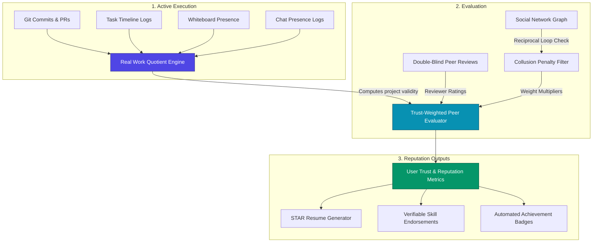
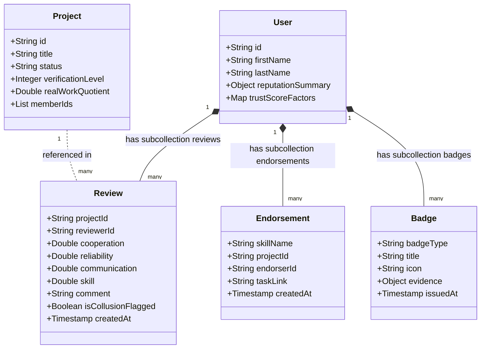

# ProCollab Trust & Reputation System Architecture
**System Design and Specifications**

ProCollab’s core value proposition relies on translating digital project collaborations into a verified professional portfolio. This document designs the platform's **Trust & Reputation System**, prioritizing authentic, verifiable work over artificial engagement metrics.

---

## 1. System Architecture Overview

The reputation network operates on a cycle: planning, active execution, verification of deliverables, and peer feedback. These signals are compiled by a background analytics engine to update a user's scores, badges, and STAR portfolios.



---

## 2. Dynamic Trust & Reputation Metrics

Rather than a single arbitrary score, user profiles expose a multidimensional reputation layout representing four primary scores, computed out of **100 points**, as well as verified credentials:

1. **Project Completion Score (PCS)**: How reliably the user finishes tasks allocated to them inside team environments.
2. **Reliability Score (RS)**: Adherence to timelines, sprint schedules, and task commitments.
3. **Collaboration Score (CS)**: Peer assessments of communication, teamwork, and actual engagement in shared spaces (Whiteboards, Meetings).
4. **Trust Score (TS)**: A meta-metric (0-100) representing the system's confidence in the authenticity of the user's reviews, projects, and work history.

---

## 3. Core Algorithms

To eliminate review inflation and prevent users from creating mock projects to self-rate, ProCollab implements mathematical adjustments:

### A. Real Work Quotient (RWQ)
The `RWQ` is a project-level multiplier between $0.0$ and $1.0$ that determines how much weight is granted to the reviews and scores originating from a project. If a project has zero commits, was completed in 10 minutes, or has only one active member doing everything, the project's reputation contributions are zeroed out or highly minimized.

$$RWQ = \text{clamp}\left( 0.3 \cdot S_{git} + 0.3 \cdot S_{timeline} + 0.2 \cdot S_{presence} + 0.2 \cdot S_{comms},\, 0.0,\, 1.0 \right)$$

Where:
*   **$S_{git}$ (Git Score)**: $\text{clamp}\left(\frac{\text{Total Commits}}{10 \times \text{Members}},\, 0,\, 1\right)$. Requires linked repository activity.
*   **$S_{timeline}$ (Duration Score)**: $\text{clamp}\left(\frac{\text{Project Age in Days}}{7},\, 0,\, 1\right)$. Prevents instantaneous projects.
*   **$S_{presence}$ (Canvas/Doc Presence)**: $\text{clamp}\left(\frac{\text{Shared Sessions with } \ge 2\text{ members}}{3},\, 0,\, 1\right)$. Checks active whiteboard collaboration.
*   **$S_{comms}$ (Chat Volume)**: $\text{clamp}\left(\frac{\text{Messages Sent}}{50},\, 0,\, 1\right)$. Verifies coordination occurred.

---

### B. Project Completion Score (PCS)
Reflects the ratio and volume of deliverables completed by a user in active projects, adjusted by the complexity of the tasks and the overall validation of the project.

$$PCS = \left( 0.5 \cdot \frac{T_{user\_done}}{T_{user\_assigned}} + 0.3 \cdot \frac{T_{on\_time}}{T_{user\_done}} + 0.2 \cdot (1 - \text{ReopenRate}) \right) \times RWQ$$

*   **$T_{user\_done}$**: Total tasks completed by the user.
*   **$T_{user\_assigned}$**: Total tasks ever assigned to the user.
*   **$T_{on\_time}$**: Tasks marked "Done" on or before the target deadline.
*   **$\text{ReopenRate}$**: Ratio of completed tasks that were subsequently pushed back into "In-Progress" or "Changes Requested" by project managers or peers.

---

### C. Trust-Weighted Peer Rating Average (TWPR)
Instead of taking a simple average of 5-star ratings, peer scores for Cooperation, Reliability, and Skill are weighted by the reviewer's own trustworthiness and potential collusion factors.

$$TWPR_{metric} = \frac{\sum_{i=1}^{N} \left( R_{i, \text{metric}} \times W_i \right)}{\sum_{i=1}^{N} W_i}$$

Where the reviewer weight $W_i$ is computed as:

$$W_i = TS_{\text{reviewer}} \times (1 - C_{i, \text{target}}) \times V_{\text{project}}$$

*   **$TS_{\text{reviewer}}$**: The Trust Score of the peer writing the review (0.1 to 1.0).
*   **$C_{i, \text{target}}$**: The **Collusion Penalty** between reviewer $i$ and the target user. If reviewer $i$ has reviewed the target multiple times across different projects, or if they have reciprocal rating logs (e.g. A reviews B, B reviews A), $C_{i, \text{target}} \to 1.0$, minimizing the review's influence.
*   **$V_{\text{project}}$**: The Project Verification Level multiplier (Unverified = 0.1, Activity-Verified = 0.5, Repo-Verified = 1.0, Sponsor-Verified = 1.2).

---

### D. Bayesian Rating Shrinkage
To prevent users with a single 5-star review from ranking above experienced users with dozens of high-quality reviews, the system applies a Bayesian prior. Profiles shrink toward a global average rating ($m$) until they meet a critical volume of assessments ($C$).

$$Rating_{\text{adjusted}} = \frac{C \cdot m + \sum_{i=1}^{N} R_i}{C + N}$$

*   **$m$ (Global Network Mean)**: Default to $4.0$ stars.
*   **$C$ (Confidence Weight)**: Set to $5$ reviews. A user with only $1$ peer review of $5.0$ stars is adjusted to:
    $$\frac{5 \times 4.0 + 5.0}{5 + 1} = 4.16 \text{ stars}$$
    While a user with $20$ reviews averaging $4.8$ stars adjusts to:
    $$\frac{5 \times 4.0 + 96.0}{5 + 20} = 4.64 \text{ stars}$$
    This ensures that seasoned contributors rank higher than freshly made, unverified profiles.

---

## 4. Firestore Schema Design

The Firestore document layout is structured to optimize read speeds, facilitate cache-friendly aggregation, and isolate sensitive review data to prevent clients from tempering with feedback scores.



### Collection Specifications

#### 1. Users Collection (`/users/{userId}`)
```json
{
  "firstName": "Alex",
  "lastName": "Rivera",
  "email": "alex.rivera@procollab.dev",
  "joinedAt": "2026-06-01T12:00:00Z",
  "isOpenToWork": true,
  "skills": ["React", "TypeScript", "TailwindCSS", "Node.js"],
  "reputation": {
    "trustScore": 94,
    "collaborationScore": 92,
    "reliabilityScore": 88,
    "completionScore": 95,
    "totalReviews": 18,
    "overallRating": 4.7
  },
  "trustScoreFactors": {
    "gitVerified": true,
    "institutionVerified": true,
    "collusionPenaltyCount": 0,
    "flaggedReviewsCount": 0
  }
}
```

#### 2. Reviews Subcollection (`/users/{userId}/reviews/{reviewId}`)
*Note: `reviewId` is formatted as `${reviewerId}_${projectId}` to guarantee only one review per reviewer per project.*
```json
{
  "projectId": "proj_987654321",
  "projectName": "E-Commerce Re-platform",
  "reviewerId": "user_abc123xyz",
  "reviewerName": "Sarah Chen",
  "reviewerAvatar": "https://api.dicebear.com/7.x/avataaars/svg?seed=Sarah",
  "cooperation": 5,
  "reliability": 4,
  "communication": 5,
  "skill": 5,
  "comment": "Alex delivered clean state-management logic on-time and was highly present during design reviews.",
  "createdAt": "2026-06-15T22:30:00Z",
  "isVerified": true,
  "isCollusionFlagged": false,
  "reviewerTrustWeight": 0.96
}
```

#### 3. Endorsements Subcollection (`/users/{userId}/endorsements/{endorsementId}`)
*Note: Endorsements are explicitly tied to task accomplishments to prevent unearned rating inflation.*
```json
{
  "skillName": "React State Management",
  "projectId": "proj_987654321",
  "projectTitle": "E-Commerce Re-platform",
  "endorserId": "user_abc123xyz",
  "endorserName": "Sarah Chen",
  "endorserRole": "Lead Architect",
  "taskLink": "/project/proj_987654321/tasks/task_state_404",
  "taskTitle": "Migrate Redux Store to React Context",
  "createdAt": "2026-06-15T22:35:00Z"
}
```

#### 4. Badges Subcollection (`/users/{userId}/badges/{badgeId}`)
```json
{
  "badgeType": "sprint_champion",
  "title": "Sprint Champion",
  "description": "Completed 10 consecutive tasks on or before the sprint deadline.",
  "icon": "ShieldAlert",
  "issuedAt": "2026-06-15T22:40:00Z",
  "evidence": {
    "projectId": "proj_987654321",
    "taskCount": 10,
    "streakDays": 14
  }
}
```

#### 5. Project Verification Data (`/projects/{projectId}`)
```json
{
  "title": "E-Commerce Re-platform",
  "status": "completed",
  "createdBy": "user_abc123xyz",
  "memberIds": ["user_alex_rivera", "user_abc123xyz"],
  "verificationLevel": 2,
  "realWorkQuotient": 0.98,
  "repository": {
    "url": "https://github.com/procollab-teams/ecommerce-replatform",
    "linkedAt": "2026-06-02T09:00:00Z",
    "totalCommits": 142
  },
  "metrics": {
    "completedTasks": 38,
    "totalTasks": 40,
    "whiteboardActiveMinutes": 240,
    "chatMessageCount": 512
  }
}
```

---

## 5. Security Rules (Firestore)

To secure the integrity of reputation records, rules must enforce that users cannot write review updates directly onto their own records or create reviews for projects they were never associated with.

```javascript
rules_version = '2';
service cloud.firestore {
  match /databases/{database}/documents {
    
    // Core User Profiles
    match /users/{userId} {
      allow read: if true;
      // Users can modify bio/skills, but cannot touch reputation summary field maps
      allow update: if request.auth != null && request.auth.uid == userId
                    && !request.resource.data.diff(resource.data).affectedKeys().hasAny(['reputation', 'trustScoreFactors']);
      allow create, delete: if false; // Managed by Auth Triggers/Cloud Functions
      
      // Peer Reviews subcollection
      match /reviews/{reviewId} {
        allow read: if true;
        // User cannot review themselves. Must be a member of the corresponding project.
        allow create: if request.auth != null 
          && request.auth.uid != userId 
          && request.resource.data.reviewerId == request.auth.uid
          && isProjectMember(request.resource.data.projectId, request.auth.uid)
          && isProjectMember(request.resource.data.projectId, userId);
        
        // Reviews are immutable once written to prevent retroactive pressure to edit reviews
        allow update, delete: if false;
      }
      
      // Endorsements
      match /endorsements/{endorsementId} {
        allow read: if true;
        allow create: if request.auth != null 
          && request.auth.uid != userId
          && request.resource.data.endorserId == request.auth.uid
          && isProjectMember(request.resource.data.projectId, request.auth.uid);
        allow update, delete: if false;
      }
      
      // Badges (System-issued only)
      match /badges/{badgeId} {
        allow read: if true;
        allow write: if false; // Only written via Firebase Admin SDK / Cloud Functions
      }
    }
    
    // Helper function to check project membership
    function isProjectMember(projectId, userId) {
      return userId in get(/databases/$(database)/documents/projects/$(projectId)).data.memberIds;
    }
  }
}
```

---

## 6. Anti-Gaming & Prevention Mechanisms

| Gaming Pattern | Attack Mechanism | System Prevention Countermeasure |
| :--- | :--- | :--- |
| **Reciprocal Feedback Collusion** | Users A and B create sandbox projects to exchange 5-star reviews repeatedly. | **Collusion Weight Decay:** Cloud Functions monitor review graphs. If reciprocal feedback coefficients surpass threshold indices, reviews written by these peers decay to $0.05$ weight. |
| **Sybil Attack Accounts** | Creating bots or sock-puppet accounts to review a main account. | **Verification Gates:** Reviews from unverified users (no linked GitHub, no email verification, no mobile MFA) are excluded from the main public score calculations. |
| **Fake Project Generation** | Spin up mock projects, immediately close them, and write fake reviews. | **Real Work Quotient (RWQ):** Projects must demonstrate structural trace activity (Gantt chart deadlines met, Git commits, concurrent collaborative drawing on the whiteboard) to release score weight. |
| **Project Owner Coercion** | Owners threaten to write poor team reviews unless members accept low payment or work overtime. | **Double-Blind Review Window:** Reviews remain locked and hidden from profiles until both members have completed their peer evaluations, or a 14-day window expires. |
| **Endorsement Spam** | Friends clicking "Endorse" on a user profile for arbitrary skills. | **Proof of Deliverables:** Endorsements are forbidden on profiles unless explicitly attached to a completed task ID and pull request within a verified project workspace. |

---

## 7. UI Concepts & Design Wireframes

### A. UI Design Mockup
Here is the visual mockup showing the glassmorphic Trust and Reputation panel:


---

### B. Profile Card (React Layout wireframe)
Below is the modern React component layout for the user profile header card, using Tailwind CSS and Lucide Icons:

```tsx
import React from 'react';
import { ShieldAlert, CheckCircle, Users, GitBranch, Award, Star } from 'lucide-react';

interface ReputationProps {
  trustScore: number;
  completionScore: number;
  reliabilityScore: number;
  collaborationScore: number;
  totalReviews: number;
  badges: Array<{ id: string; title: string; type: string }>;
}

export const TrustPanel: React.FC<ReputationProps> = ({
  trustScore,
  completionScore,
  reliabilityScore,
  collaborationScore,
  totalReviews,
  badges
}) => {
  return (
    <div className="bg-slate-900 border border-slate-800 text-white rounded-2xl p-6 shadow-xl max-w-xl">
      {/* Header Profile Trust Metric */}
      <div className="flex items-center justify-between border-b border-slate-800 pb-5 mb-5">
        <div>
          <h3 className="text-lg font-bold tracking-tight">System Reputation & Verification</h3>
          <p className="text-xs text-slate-400">Calculated based on real git commits, whiteboard logs, and peer evaluations.</p>
        </div>
        <div className="relative flex items-center justify-center">
          <svg className="w-16 h-16 transform -rotate-90">
            <circle cx="32" cy="32" r="28" className="stroke-slate-800 fill-none" strokeWidth="4" />
            <circle cx="32" cy="32" r="28" className="stroke-indigo-500 fill-none" strokeWidth="4" 
              strokeDasharray={175} strokeDashoffset={175 - (175 * trustScore) / 100} />
          </svg>
          <span className="absolute text-sm font-bold">{trustScore}%</span>
        </div>
      </div>

      {/* Main Metric Sliders */}
      <div className="space-y-4">
        {[
          { label: 'Technical Completion Rate', value: completionScore, icon: GitBranch, color: 'bg-emerald-500' },
          { label: 'Sprint & Timeline Reliability', value: reliabilityScore, icon: CheckCircle, color: 'bg-indigo-500' },
          { label: 'Collaboration & Whiteboard Presence', value: collaborationScore, icon: Users, color: 'bg-cyan-500' }
        ].map((metric, i) => (
          <div key={i} className="space-y-1">
            <div className="flex justify-between items-center text-xs">
              <span className="flex items-center gap-1.5 text-slate-350">
                <metric.icon className="h-3.5 w-3.5 text-slate-400" />
                {metric.label}
              </span>
              <span className="font-semibold">{metric.value}/100</span>
            </div>
            <div className="h-2 w-full bg-slate-800 rounded-full overflow-hidden">
              <div className={`h-full ${metric.color} rounded-full`} style={{ width: `${metric.value}%` }} />
            </div>
          </div>
        ))}
      </div>

      {/* Badges and Credentials Row */}
      <div className="mt-6 border-t border-slate-800 pt-5">
        <h4 className="text-xs font-bold text-slate-400 uppercase tracking-wider mb-3 flex items-center gap-1.5">
          <Award className="h-4 w-4 text-indigo-400" />
          Verified Badges ({badges.length})
        </h4>
        <div className="flex flex-wrap gap-2">
          {badges.map((badge) => (
            <span 
              key={badge.id} 
              className="inline-flex items-center gap-1.5 px-3 py-1 bg-slate-800 hover:bg-slate-750 transition-colors border border-slate-700 text-xs font-semibold text-slate-200 rounded-full cursor-help"
              title="Click to view cryptographic proof of work signature."
            >
              <CheckCircle className="h-3.5 w-3.5 text-indigo-400" />
              {badge.title}
            </span>
          ))}
        </div>
      </div>
      
      {/* Review Count Info */}
      <div className="flex justify-between items-center text-[10px] text-slate-500 mt-5 border-t border-slate-800/50 pt-3">
        <span className="flex items-center gap-1">
          <ShieldAlert className="h-3 w-3 text-slate-400" />
          Double-blind reviewed and cryptographically locked.
        </span>
        <span>{totalReviews} Peer Reviews</span>
      </div>
    </div>
  );
};
```

---

## 8. Development Implementation Roadmap

To execute this architecture efficiently, implementation should proceed in four phases:

1.  **Phase 1: Activity Tracker Integration**
    *   Deploy Firestore listener functions for task state completion transitions.
    *   Implement Git webhook listeners to logs commit counts to `gitActivity` subcollections.
2.  **Phase 2: Review Ledger & Firestore Security rules**
    *   Deploy Firestore permission schemas to lock `/reviews` subcollections.
    *   Develop the double-blind review timer cloud trigger (reveals reviews after both members complete form or 14 days lapse).
3.  **Phase 3: Mathematical Score Compilation Functions**
    *   Deploy a daily cron job scheduled Cloud Function to recalculate `trustScore`, `reliabilityScore`, and `collaborationScore` via Bayesian averages.
    *   Implement the collusion penalty graph check logic.
4.  **Phase 4: Badging, Endorsement Proofs, and STAR Export**
    *   Build automated credential granting rules (e.g. check for Git + 10 sprints met to issue `Sprint Champion` badge).
    *   Connect the STAR Portfolio Generator with verified completions.
